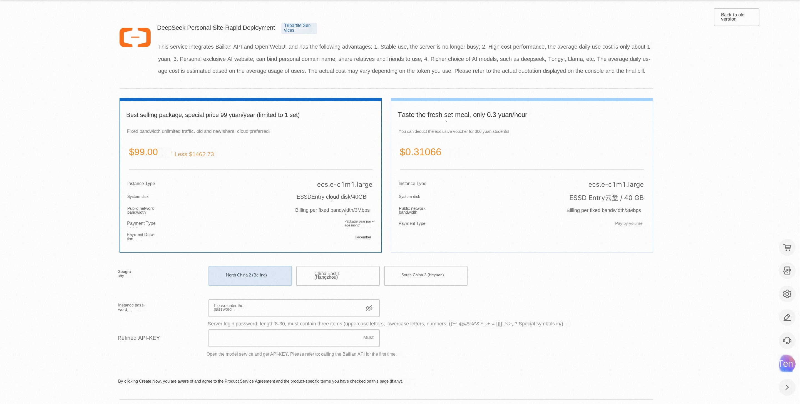
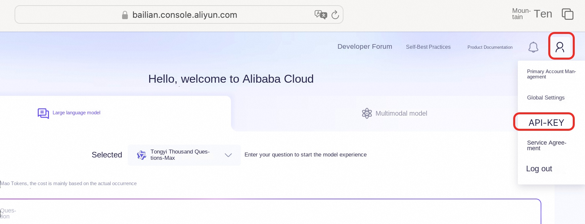
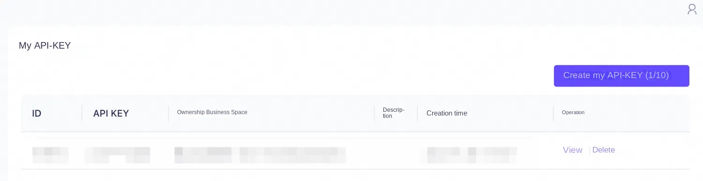
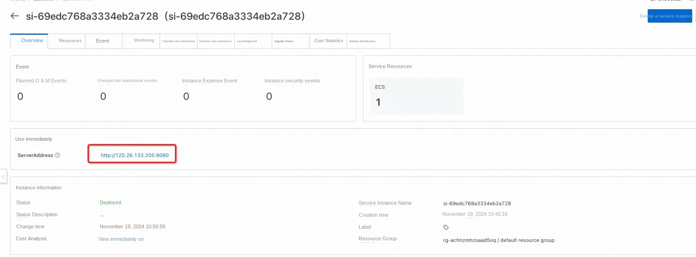
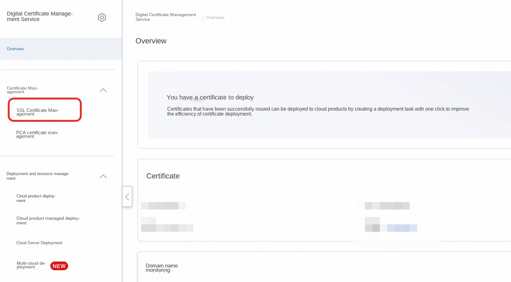
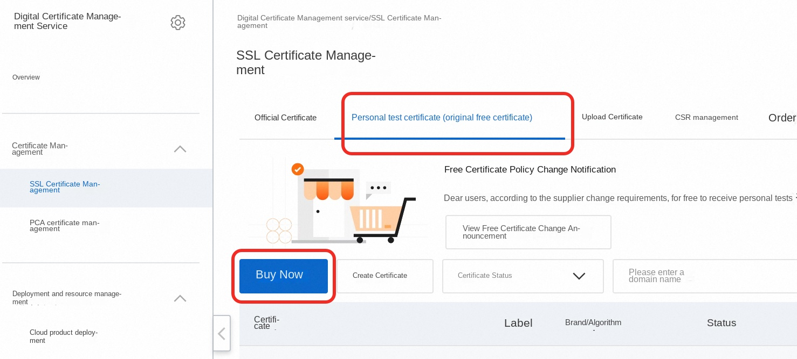
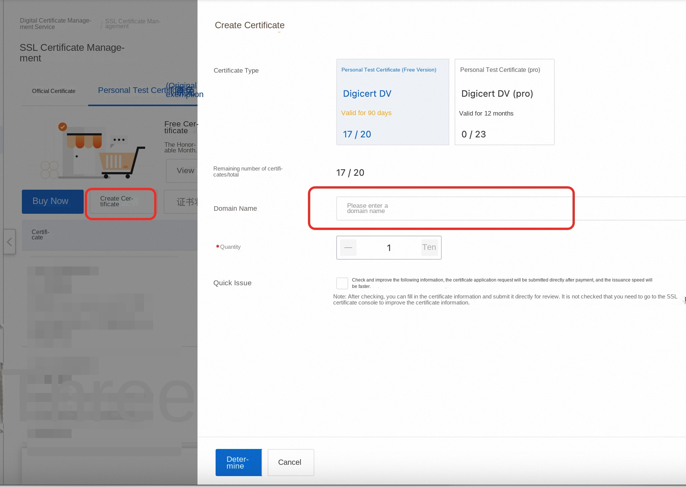
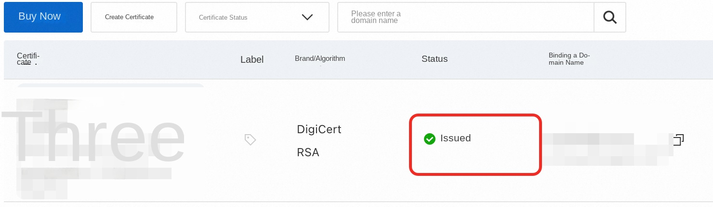
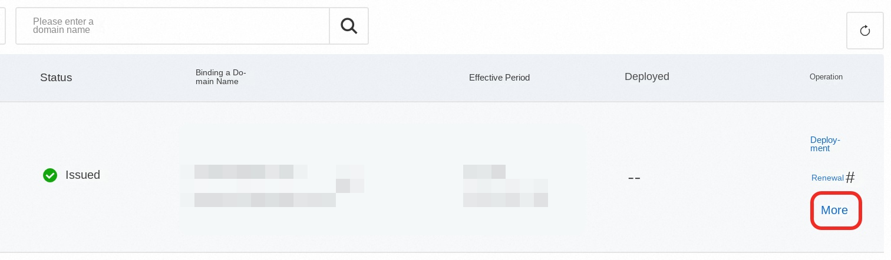
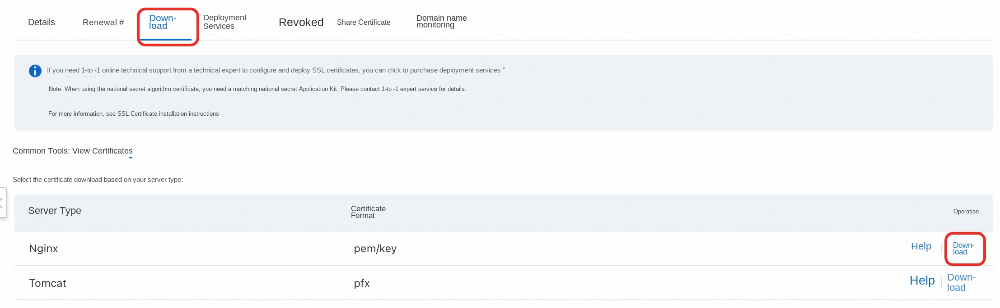

# Refined Open WebUI Service Instance Deployment Document

## Introduction to Open WebUI and Refined

Open WebUI is a feature-rich and user-friendly self-hosted web user interface (WebUI) designed to interact with large language models (LLMs), specifically those supported by Ollama or services compatible with the OpenAI API. Open WebUI provides the ability to run completely offline, which means that users can talk to models without an internet connection, which is especially important for data privacy and security-sensitive application scenarios.
Here are some of the key features of Open WebUI:
Intuitive interface: Open WebUI's interface is inspired by ChatGPT, providing a clear and user-friendly chat interface that makes interaction with large language models intuitive.
2. Extensibility: This platform is extensible, meaning that it can be customized and enhanced by adding new plug-ins or features to adapt to different usage scenarios and needs.
3. Offline operation: Open WebUI supports completely offline operation, does not rely on network connection, and is suitable for use on any device, whether on an airplane or in remote areas.
Compatibility: It is compatible with multiple LLM runers, including Ollama and OpenAI APIs, which allows users to select and run different language models from multiple sources.
Self-hosted: Users can deploy Open WebUI on their own servers or devices, which provides greater protection for data privacy and control.
Markdown and LaTeX support: Open WebUI provides comprehensive Markdown and LaTeX functionality that allows users to generate rich text output, which is useful in scientific and academic communication.
Local RAG integration: The Retrieval Enhanced Generation (RAG) feature allows the model to leverage locally stored data for more in-depth and specific responses, enhancing chat interactions.
Tongyi Bailian is an advanced multi-modal pre-training model launched by Alibaba Cloud. It combines natural language processing (NLP) and computer vision (CV) techniques to understand and generate many types of data, such as text, images, and video. The design goal of Tongyi Bailian is to provide developers and enterprises with a powerful tool for more efficient and intelligent data processing and analysis in various application scenarios.

This service integrates openwebui with Bailian and provides UI service based on Bailian with one click.

## Billing Description
The cost of the Open Web UI panel on Alibaba Cloud is mainly related:
* Specifications of the selected GPU cloud server
* Disk Capacity
* Internet Bandwidth

Billing method: pay by volume (hour) or package year and month
The estimated cost can be seen in real time when the instance is created.

Refined model call cost:
* When you first open the Hundred Refinement, the platform will automatically issue the exclusive free quota for newcomers of each model for you. For details, please refer to [Hundred Refinement Newcomer Free Quota](https://help.aliyun.com/zh/model-studio/new-free-quota?spm=a2c4g.11186623.help-menu-2400256.d_4_1.6dea55efFQCijR#view-quota).

## Deployment Architecture

The deployment architecture adopts ECS (cloud server) stand-alone deployment

## Permissions required for RAM accounts

| Permission policy name | Comment |
| ------------------------------------- | -------------------- |
| AliyunECSFullAccess | Permissions for managing ECS instances |
| AliyunVPCFullAccess | Permissions for managing a VPC |
| AliyunROSFullAccess | Manage permissions for Resource Orchestration Service (ROS) |
| AliyunComputeNestUserFullAccess | Manage user-side permissions for the compute nest service (ComputeNest) |

## Deployment Services

1. Click [Deployment Link](https://computenest.console.aliyun.com/service/palworld/deploy?ServiceId=service-5ad5f65c6c5f4c3fb838) to enter the service instance deployment interface, and fill in the parameters according to the interface prompt.

2. The deployment parameters need to be API-KEY. **[Log on to the Refinement console](https://bailian.console.aliyun.com/)**. Hover the cursor over the pedestrian icon in the upper-right corner and click **API-KEY**.

Click **Create My API-KEY** and copy it for standby. API-KEY is personal confidential information, do not disclose. If Bailian has not been opened, please click [Open Bailian Model Service](https://help.aliyun.com/zh/model-studio/getting-started/first-api-call-to-qwen?spm=a2c4g.11186623.help-menu-2400256.d_0_1_0.5a06b0a8lg5WY2#5058e161041ps) to complete the opening.

3. After confirming the order is completed, click **Create Now**.
4. After the deployment is completed, you can start using the service. Enter the service instance details and click Address to access.

5. Register an account and log in to the service.

Start your AI conversation.

## Advanced operations (use a domain name and bind a certificate)

Using IP addresses, such as http:// public network IP:8080, to visit AI websites deployed by yourself is not convenient to remember and not cool enough. When accessing through a domain name, the complete way is: https://example.com. You may not usually notice the https on the leftmost side of the domain name. This is currently the most common protocol for accessing the Internet. The early protocol was http. Later, in order to enhance security, an "S" was added after http, that is, Hypertext Transfer Security Protocol. SSL certificate is required to use https. At present, most websites use https. If http is used, the browser will prompt that it is not safe. In addition, https is required when developing WeChat applet, apple iOS app.

### 1. purchase a domain name and complete the domain name filing, which usually takes a few days to complete.

### Get a free SSL certificate 2.
1. Log on to the Alibaba Cloud Digital Certificate Management Service (formerly SSL Certificate) website https://www.aliyun.com/product/cas click Log on to the console"

2. Click on SSL Certificate Management

3. Click on "Personal Test Certificate (original free certificate)" and then click on "Buy Now".

4. Select "Personal Test Certificate" and you can get 20 free personal test certificates.

5. After the purchase is complete, click "Create Certificate" and select the "Personal Test Certificate (Free Edition)" purchased in the previous step for the certificate type. In the "Domain Name", enter the domain name, such as example.com. You do not need to enter www.example.com here. Then click OK ".

6. When the certificate shows "issued", it can be used normally. Please note that free certificates are generally valid for three months.

7. Click "More" to prepare to download the certificate.

8. Click the tab of "Download" and click "Download" after Nginx to download the certificate.

9. The downloaded certificate is a compressed package. After clicking decompress, there are two files in the folder, with key and pem as suffixes respectively.

### 3. install and configure nginx on ECS

'''Shell

# Update the installation package list
sudo apt update
Install nginx
sudo apt install nginx
# Confirm whether nginx is installed successfully
sudo systemctl status nginx
'''

### 4. to create an SSL certificate storage directory and save the SSL certificate to the cloud server ECS
'''Shell

# In the nginx configuration directory, create an SSL certificate storage directory
mkdir /etc/nginx/ssl
# Enter the SSL certificate storage directory
cd /etc/nginx/ssl

# Create the following two files. Assume that the domain name is example.com. Replace the domain name with your own domain name.
touch example.com.key
touch example.com.pem

# On the computer, open the example.com.key file saved in the previous step and copy the contents

# Go back to the ECS instance and edit the file example.com.key
vim example.com.key
# Click I to enter the editing mode and paste the newly copied content into the example.com.key file on the cloud server ECS. After completion, click ECS to exit editing and enter! wq, save and exit

# On the computer, open the example.com.pem file saved in the previous step and copy the contents
# Go back to the ECS instance and edit the file example.com.key
vim example.com.pem
# Click I to enter the editing mode and paste the newly copied content into the example.com.pem file on the cloud server ECS. After completion, click ECS to exit editing and enter! wq, save and exit
'''

### 5. to configure nginx
'''Shell
# Enter the sites-available directory
cd /etc/nginx/sites-available

# Create a configuration file. Note that you need to change it to your own domain name here.
touch example.com
'''

Use the vim example.com command to open the example.com file, click I to edit, and paste the following content.
Note: In the following, replace all example.com with your own domain name.
'''txt
server {
listen 80;
server_name example.com www.example.com;

# Redirect all HTTP requests to HTTPS
return 301 https://$host$request_uri;
}

server {
listen 443 ssl;
server_name example.com www.example.com;

# SSL Configuration
ssl_certificate /etc/nginx/ssl/example.com.pem;
ssl_certificate_key /etc/nginx/ssl/example.com.key;

# Security headers (optional but recommended)
add_header Strict-Transport-Security "max-age=31536000" always;
add_header X-Content-Type-Options nosniff;
add_header X-Frame-Options "SAMEORIGIN ";
add_header X-XSS-Protection "1; mode=block ";

# Proxy settings
location / {
proxy_pass http://localhost:8080; # Your service running on port 8080
proxy_set_header Host $host;
proxy_set_header X-Real-IP $remote_addr;
proxy_set_header X-Forwarded-For $proxy_add_x_forwarded_for;
proxy_set_header X-Forwarded-Proto $scheme;

# WebSocket support (if needed)
proxy_http_version 1.1;
proxy_set_header Upgrade $http_upgrade;
proxy_set_header Connection "upgrade ";
}
}
'''
### 6. to establish soft connection
Note: In the following, replace all example.com with your own domain name.
'''Shell
sudo ln -s /etc/nginx/sites-available/example.com /etc/nginx/sites-enabled/
'''

Re-load nginx
'''Shell
sudo systemctl reload nginx
'''

### 7. configuration domain name resolution
enter the domain name resolution dns console
https://dns.console.aliyun.com/
Select the domain name to be used and click "Resolution Settings"

Click Add Record"

Fill in the record content as follows, and then click "OK". It will take effect in about 1 minute. that is, you can access your deployed AI website through the domain name.

## FAQ

DeepSeek-R1 Start Thinking Mode [Reference Community Program](https://www.zhihu.com/question/10904918866/answer/99141193645)