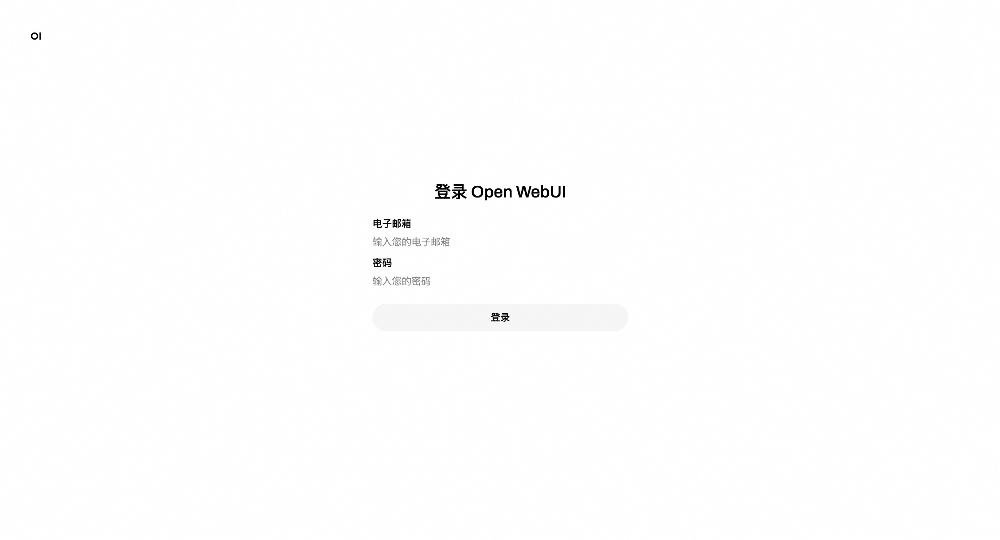

<h1> Refined Open WebUI Service Instance Deployment Document </h1>

<h2> Introduction to Open WebUI and Refined </h2>

Open WebUI is a feature-rich and user-friendly self-hosted Web user interface (WebUI) designed to interact with large language models (LLMs), especially those supported by Ollama or services compatible with the OpenAI API. Open WebUI provides the ability to run completely offline, which means that users can talk to models without an internet connection, which is especially important for data privacy and security-sensitive application scenarios.
Here are some of the key features of Open WebUI:
Intuitive interface: Open WebUI's interface is inspired by ChatGPT, providing a clear and user-friendly chat interface that makes interaction with large language models intuitive.
2. Extensibility: This platform is extensible, meaning that it can be customized and enhanced by adding new plug-ins or features to adapt to different usage scenarios and needs.
3. Offline operation: Open WebUI supports completely offline operation, does not rely on network connection, and is suitable for use on any device, whether on an airplane or in remote areas.
Compatibility: It is compatible with multiple LLM runers, including Ollama and OpenAI APIs, which allows users to select and run different language models from multiple sources.
Self-hosted: Users can deploy Open WebUI on their own servers or devices, which provides greater protection for data privacy and control.
Markdown and LaTeX support: Open WebUI provides comprehensive Markdown and LaTeX functionality that allows users to generate rich text output, which is useful in scientific and academic communication.
Local RAG Integration: The Retrieval Enhanced Generation (RAG) feature allows the model to leverage locally stored data for more in-depth and specific responses, enhancing chat interactions.
Tongyi Bailian is an advanced multi-modal pre-training model launched by Alibaba Cloud. It combines natural language processing (NLP) and computer vision (CV) techniques to understand and generate many types of data, such as text, images, video, and more. The design goal of Tongyi Bailian is to provide developers and enterprises with a powerful tool for more efficient and intelligent data processing and analysis in various application scenarios. 

 this service integrates openwebui and refining, and provides ui service based on refining with one click 

<h2> Billing instructions </h2>

 The cost of the Open WebUI panel on Alibaba Cloud is mainly related:
* Specifications of the selected GPU cloud server
* Disk Capacity
* Internet bandwidth 

 Billing method: Pay-as-you-go (hourly) or package year and month
The estimated cost can be seen in real time when the instance is created. 

 Refined model call cost:
* When you open the Hundred Refinement for the first time, the platform will automatically issue exclusive free quotas for newcomers of each model. For more information, see <a href = "https://help.aliyun.com/zh/model-studio/new-free-quota?spm=a2c4g.11186623.help-menu-2400256.d_4_1.6dea55efFQCijR#view-quota"> Hundred Refinement Newcomer Free Quota </a>. 

<h2> Permissions required for RAM accounts </h2>

<table>
<thead>
<tr>
<th> Permission policy name </th>
<th> Remarks </th>
</tr>
</thead>
<tbody>
<tr>
<td>AliyunECSFullAccess</td>
<td> Permissions to manage ECS </td>
</tr>
<tr>
<td>AliyunVPCFullAccess</td>
<td> Permissions for managing VPC networks </td>
</tr>
<tr>
<td>AliyunROSFullAccess</td>
<td> Manage permissions for Resource Orchestration Services (ROS) </td>
</tr>
<tr>
<td>AliyunComputeNestUserFullAccess</td>
<td> Manage user-side permissions for the compute nest service (ComputeNest) </td>
</tr>
</tbody>
</table>

<h2> Deployment Services </h2>

<ol>
<li> Click <a href = "https://computenest.console.aliyun.com/service/instance/create/ap-southeast-1?type=user&ServiceId=service-7bbc5e7bf96c4e68b856"> Deployment Link </a> to go to the service instance deployment page. Enter the parameters as prompted.
</li>
<li>
 Click <strong> Create Now </strong> after confirming the order is complete. 
</li>
<li>
 After the deployment is completed, you can start using the service. Enter the service instance details and click Address to access.

</li>
<li>
 Register an account and log in to the service.

</li>
<li>
 Start your AI conversation.

</li>
</ol>

DeepSeek-R1 open thinking mode <a href = "https://www.zhihu.com/question/10904918866/answer/99141193645"> refer to the community plan </a>

