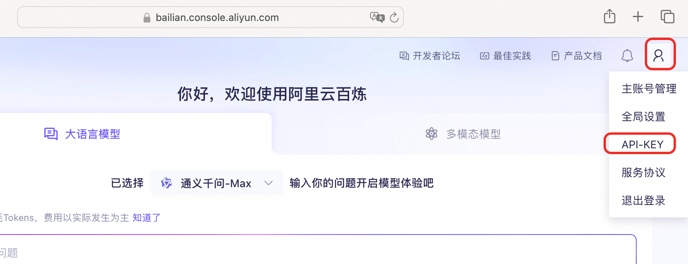
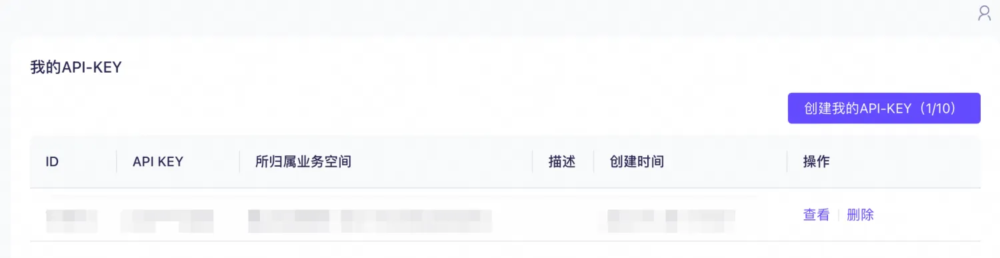

# 百炼 Open WebUI 服务实例部署文档

## Open WebUI和百炼介绍

Open WebUI 是一个功能丰富且用户友好的自托管 Web 用户界面（WebUI），它被设计用于与大型语言模型（LLMs）进行交互，特别是那些由 Ollama 或与 OpenAI API 兼容的服务所支持的模型。Open WebUI 提供了完全离线运行的能力，这意味着用户可以在没有互联网连接的情况下与模型进行对话，这对于数据隐私和安全敏感的应用场景尤为重要。
以下是 Open WebUI 的一些主要特点：
1. 直观的界面：Open WebUI 的界面受到 ChatGPT 的启发，提供了一个清晰且用户友好的聊天界面，使得与大型语言模型的交互变得直观。
2. 扩展性：这个平台是可扩展的，意味着可以通过添加新的插件或功能来定制和增强其能力，适应不同的使用场景和需求。
3. 离线操作：Open WebUI 支持完全离线运行，不依赖于网络连接，适合在任何设备上使用，无论是在飞机上还是在偏远地区。
4. 兼容性：它兼容多种 LLM 运行器，包括 Ollama 和 OpenAI 的 API，这使得用户可以从多个来源选择和运行不同的语言模型。
5. 自托管：用户可以在自己的服务器或设备上部署 Open WebUI，这为数据隐私和控制提供了更高的保障。
6. Markdown 和 LaTeX 支持：Open WebUI 提供了全面的 Markdown 和 LaTeX 功能，让用户可以生成富文本输出，这在科学和学术交流中非常有用。
7. 本地 RAG 集成：检索增强生成（RAG）功能允许模型利用本地存储的数据进行更深入和具体的回答，增强了聊天交互的功能。
通义百炼 是阿里巴巴云推出的一款先进的多模态预训练模型。它结合了自然语言处理（NLP）和计算机视觉（CV）技术，能够理解和生成文本、图像、视频等多种类型的数据。通义百炼的设计目标是为开发者和企业提供一个强大的工具，以便在各种应用场景中实现更高效、更智能的数据处理和分析。

本服务将openwebui和百炼集成，一键提供基于百炼的ui服务

## 计费说明
Open WebUI面板在阿里云上的费用主要涉及：
* 所选GPU云服务器的规格
* 磁盘容量
* 公网带宽
计费方式：按量付费（小时）或包年包月
预估费用在创建实例时可实时看到。

## 部署架构

部署架构采用ECS(云服务器)单机部署

## RAM账号所需权限

| 权限策略名称                          | 备注                     |
|---------------------------------|------------------------|
| AliyunECSFullAccess             | 管理云服务器服务（ECS）的权限       |
| AliyunVPCFullAccess             | 管理专有网络（VPC）的权限         |
| AliyunROSFullAccess             | 管理资源编排服务（ROS）的权限       |
| AliyunComputeNestUserFullAccess | 管理计算巢服务（ComputeNest）的用户侧权限 |

## 部署流程

### 部署步骤

AI模型的运行需要使用GPU，价格较高。例如，deepseek-r1满血版，如果使用GPU部署，每月需花费数万元。使用百炼，用户不需要自己在GPU上部署模型，而是通过百炼提供的API使用AI模型。按使用的token数计费。

1. 单击部署链接，进入服务实例部署界面，根据界面提示，填写参数完成部署。添加部署参数需要选择百炼key
**登录百炼控制台，获取百炼API地址和API-KEY**
[阿里云登录 - 欢迎登录阿里云，安全稳定的云计算服务平台](https://bailian.console.aliyun.com/)
光标悬停在右上角人行图标上，点击“API-KEY”

点击“创建我的API-KEY”，创建API-KEY，并复制它备用。API-KEY是个人保密信息，切勿泄漏。

2. 参数填写完成后可以看到对应询价明细，确认参数后点击**下一步：确认订单**

3. 确认订单完成后同意服务协议并点击**立即创建**
4. 等待部署完成后就可以开始使用服务，进入服务实例详情点击Address访问。

5.使用服务

## 使用服务

访问刚才创建好的Open WebUI

点击网页左下角的用户名图标，点击“设置”

点击“管理员设置”

点击“外部连接”，然后点击“管理OpenAPI连接”右边的“+”符号。

在“模型ID”中输入deepseek-r1，注意需要小写。

最后点击保存。

在网页的右上方，能看见deepseek-r1字样时，就可以正常使用满血版deepseek-r1模型了。

